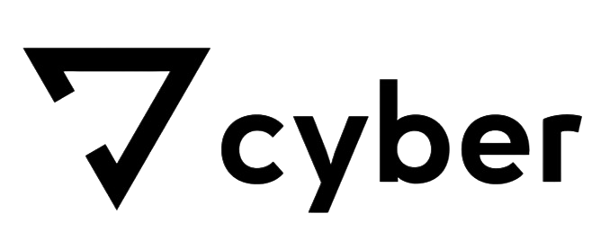

# CYBER — Интернет-магазин электроники

[](https://vuejs.org/)
[](https://vitejs.dev/)
[](https://pinia.vuejs.org/)

> Полнофункциональный интернет-магазин с корзиной, избранным, фильтрацией и поиском.



---

## Технологии

| Технология | Назначение |
|------------|------------|
| Vue 3 | UI фреймворк |
| Vite | Сборка проекта |
| Pinia | Управление состоянием |
| Vue Router | Маршрутизация |
| CSS | Стилизация |

---

## Установка и запуск

```bash
# Клонирование
git clone <repository-url>
cd 7cyber-shop

# Установка зависимостей
npm install

# Запуск в режиме разработки
npm run dev

# Сборка для продакшена
npm run build

# Предпросмотр сборки
npm run preview
=======
# cyber
```
